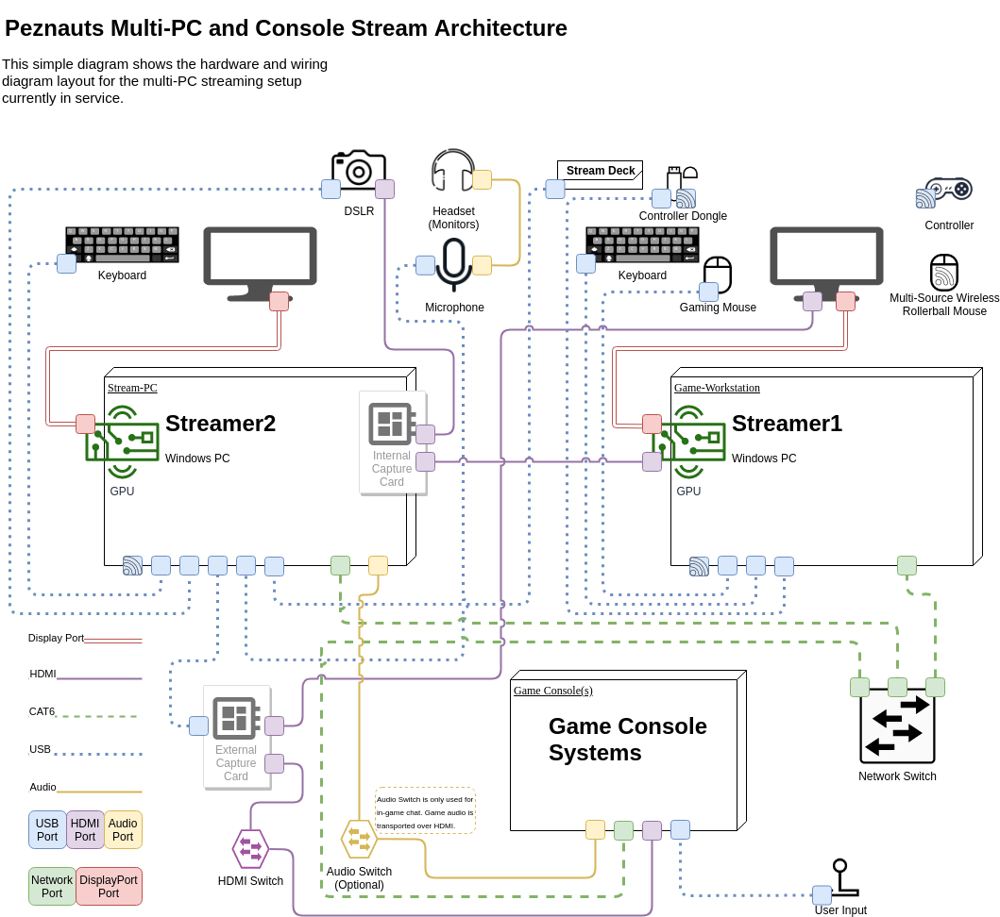

# stream-layout

Stream Diagrams for setup and device layout.

This repository will be used to diagram the various systems and
processes that support the [Peznauts](https://peznauts.com)
[live stream](https://peznauts.com/streaming) and content
creation setup.

> All diagrams will be made available in `PNG` and `SVG` format
  with embedded images and a transperant background.

